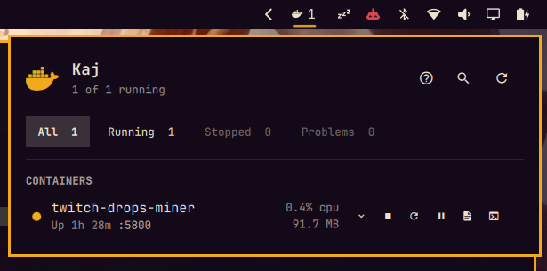

# Kaj

Docker containers in the Omarchy bar.

*Kaj* is Swedish for quay.



## Install

```bash
omarchy plugin add https://github.com/leonlarsson/omarchy-kaj.git --enable
```

Requires the `docker` CLI and a reachable daemon.

Optionally bind the panel to a key:

```lua
-- ~/.config/hypr/bindings.lua
o.bind("SUPER + D", "Docker", "omarchy-shell mozzy.kaj toggle")
```

## Keys

| Key | Action |
|---|---|
| `h` / `l` | Switch view |
| `j` / `k` | Move between containers, or scroll the other views |
| `f` | Cycle the status filter |
| `Enter` | Start or stop the selected container |
| `r` | Restart |
| `o` | Logs |
| `s` | Shell |
| `p` | Pause or resume |
| `x` | Remove (asks first) |
| `e` | Show environment variables |
| `Ctrl+F` or `/` | Search by name, service, project, or image |
| `?` | Show every shortcut in the panel |
| `Esc` | Clear the search, then close the panel |

## Views

Containers, Images, Volumes, Networks, and Disk.

Containers shows live CPU and memory, with a bar against the container's memory
limit when it has one.

Images lists what is on disk largest first and flags anything no container
uses. Volumes shows each volume's size and the containers using it. Networks
shows subnet and connected containers, with the built-in `bridge`, `host`, and
`none` kept at the bottom. Disk is `docker system df`, with whatever is
reclaimable called out.

Volumes and Networks are read-only. What is using them is worked out from the
containers Kaj already watches, so a volume stops reading as unused the moment
something mounts it, rather than when the view is next opened.

## Compose projects

Hovering a project header reveals `start`, `stop`, `restart`, and `down`, run as
real `docker compose --project-name <name> <verb>` commands rather than as a
loop over containers, so networks and dependency order are Compose's to handle.
`down` is confirmed first. `up` is not offered: it needs the compose file, which
Kaj cannot rely on still being where it was.

## Settings

Set per widget with `omarchy bar set mozzy.kaj <key> <value> --json`, or in
`~/.config/omarchy/shell.json`. Pass `--json` so the value is written as a real
boolean or number rather than a string.

| Setting | Default | Description |
|---|---|---|
| `readOnly` | `false` | Disable every action that changes a container. Status, stats, and logs still work. The lock in the panel header toggles it. |
| `showStats` | `true` | Stream live CPU and memory. |
| `defaultFilter` | `all` | Status filter selected when the panel opens: `all`, `running`, `stopped`, or `problems`. |
| `notifyOnExit` | `false` | Notify when a container exits non-zero or is OOM-killed. The bell in the panel header toggles it. |
| `refreshIntervalSec` | `30` | Reconcile interval. Kaj follows `docker events`, so this only bounds how long a missed event goes unnoticed. |
| `logLines` | `500` | History shown before `logs` starts following. |

To put every setting back to its default:

```bash
~/.config/omarchy/plugins/mozzy.kaj/kaj-reset
```

## Security

The Docker socket is root-equivalent: anything that can reach it, including
every member of the `docker` group, can become root on the host. That is a
property of Docker, not of Kaj, but Kaj runs inside the long-lived shell
process, so it is written accordingly.

- Every command is an argv array. No `bash -c`, and no container name, image
  tag, or label is interpolated into a command line.
- Container state is read with `docker inspect --format`, where every value is
  `{{json .Field}}` and every key is a literal.
- Container-controlled text is rendered as `Text.PlainText` with escape
  sequences and control bytes stripped.
- Environment variables are fetched only for the row you expand, and every
  value is hidden until you click it. Kaj does not try to guess which keys are
  secret: the one such a rule misses is the one that leaks.
- Removing a container asks first, and the prompt names what is deleted and
  what is kept. Start, stop, and restart do not prompt.
- Kaj never calls `sudo` or `pkexec`.

[Rootless Docker](https://docs.docker.com/engine/security/rootless/) avoids the
root-equivalence entirely. Kaj honours `DOCKER_HOST`.

Please open an issue for security reports.

## Development

```bash
npm test                    # pure logic, no QML or Docker needed
omarchy plugin validate .

dev/kaj seed                # containers covering every state the panel renders
dev/kaj status              # list them
dev/kaj crash solo          # drive a state change and watch the panel react
dev/kaj oom                 # a container that gets OOM-killed
dev/kaj unhealthy           # a container that fails its healthcheck
dev/kaj clean               # remove them all
```

`dev/kaj --help` lists everything. It labels what it creates `kaj.dev=1` and
refuses to act on any container without that label, so it cannot touch a
workload you care about.

`Model.js` holds parsing, grouping, formatting, and policy as pure functions.
`Service.qml` talks to the daemon. `BarWidget.qml` and `Panel.qml` render.

Run `omarchy restart shell` to pick up edits.

## License

MIT
